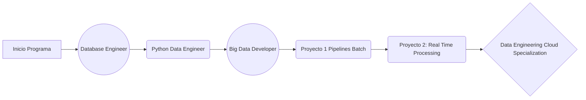

# Repositorio

Participantes:
- **Irving Juanico**
- **Elias Gregorio Pena**
- **Henry De la O**

Este es un repositorio de prueba colaborativa Session 2 clase Git DataPath bootcamp

Segundo commit - **Irving Juanico**

**Actividades realizadas:**
- Creacion Nuevo archivo - Egregoryp
- Creacion Readme - Iving
- Ajustes Readme - Egregoryp
- Ajustes Otro archivo - Henry
- Creacion Flow Chart en Readme - Egregoryp

**Data Engineering Bootcamp in DataPath flow chart:**
